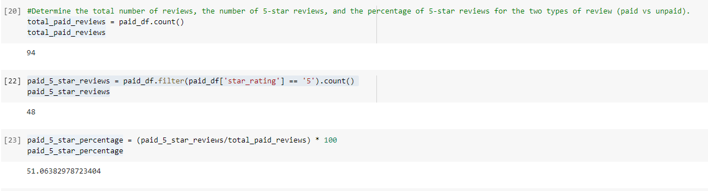
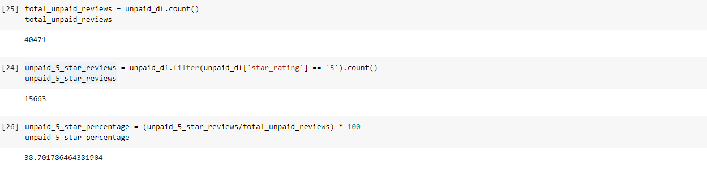

# Amazon Vine Analysis

## Resources 
* AWS - RDS
* Postgres SQL, pgAdmin
* Google Colaboratory, PySpark
* [AWS- index.txt](https://s3.amazonaws.com/amazon-reviews-pds/tsv/index.txt)
* [Amazon_Reviews_ETL.ipynb](Amazon_Reviews_ETL.ipynb)
* [Vine_Review_Analysis.ipynb](Vine_Review_Analysis.ipynb)

## Overview of the analysis of the Vine Program 
The purpose of this analysis was to observe the Amazon reviews for Video Games in the US. The analysis compared the reviews written by associates in a paid Amazon Vine program. This service provides manufacturers and publishers the ability to receive the comments left by customers on their products. Sellby pays a fee to members of this program and in return, they are required to leave a review on the product. For analysis, an ETL process was used with AWS RDS instance, and pgAdmin. 

## Results 
1) From the analysis, it was found to have a total of **94** Vine reviews and **40471** non-Vine reviews. Clearly there are significantly more unpaid reviews in comparison with those paid in the Amazon Vine Program. 
2) There were a total of **48** 5 star reviews from members in the Vine program. In comparison, there were a total of **15663** 5 star non-Vine reviews. 
3) Amongst the paid Vine reviews, **51%** were 5 star reviews. For the non-Vine reviews, **39%** were 5 star reviews left by consumers. 

**Vine Program Review Data**

**Non-Vine Consumer Review Data**

## Summary 
In conclusion, there is a positivity bias for reviews in the Vine program. The percentage of 5 star reviews left by paid Vine members was observed to be 51% which is 12% higher than the 39% of 5 star reviews left by non-Vine customers. Additional analysis can be done to incorporate more data to support this statement from the other columns in the original dataset. The review headline and review body columns can be observed for further insight as to comments left by Vine program members versus non-Vine consumers. 
